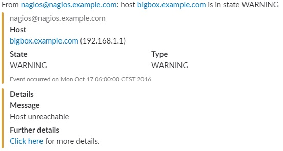
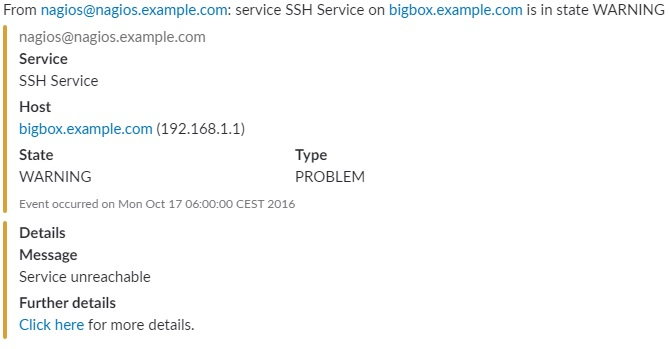
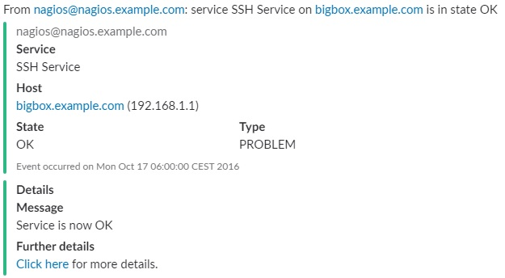

# Summary
Here are some scripts and utilities I'm using to integrate [Slack](https://slack.com/) with other apps and services. They don't use Perl. Instead, they're simple *bash* script that only require [curl](https://curl.haxx.se/) to be installed.
Use them freely.

These scripts have been tested with:
* [Nagios](https://www.nagios.org/)
* [Zabbix](https://www.zabbix.com/)
Below you can find instructions on how to set them up.

## Slack alert notification scripts
* `slack-nagios-alert.sh` is the script specifically tailored for [Nagios](https://www.nagios.org/) that sends alerts to [Slack](https://slack.com/)
* `slack-zabbix-alert.sh`, on the other hand, is suited for [Zabbix](https://www.zabbix.com/)

As you can see from the example screenshots below, these scripts send meaningful and well formatted notifications to Slack, using different colors to give a quick idea of the severity. Moreover, back links are provided so that you just need to click on them to open the issue specific page of the monitoring platform.

# Set up
## Set up the Slack Webhook
In order to receive notifications you need an active Slack team and know which channel you will send the notifications to. You may wish to set up a new channel for notifications.
For general instructions about Slack incoming webhooks just jump to [this page](https://api.slack.com/incoming-webhooks).

Then you're ready to set up your webhook by following these simple steps:
1. open the [Incoming Webhook](https://my.slack.com/services/new/incoming-webhook/) custom integration page for your team
2. in the *Post to Channel* box select the default channel you want notifications to be sent to (or create a new channel in place). You will be able to override the target channel when using the script to send notifications
3. in the next page take note of the **Webhook URL** that was generated and optionally set other fields like the webhook label, name, icon etc. The URL looks like `https://hooks.slack.com/services/ABCDEFGHI/FGHIJKLMN/123abc456def789ldt645Bgs`. In the **Customize Name** field you can set the username you want notifications to appear from. For example you may set `nagios` or `zabbix`

Now you're ready to go on the Slack side and you can start sending notifications.

## Set up Slack alert notifications for Nagios
Before you go any further you can test the script by sending manual notifications and simulate alerts.

# Example screenshots
A *CRITICAL* message about a *HOST* from Nagios

You can simulate this message by invoking the `slack-nagios-alert.sh` manually like:
```
./slack-nagios-alert.sh -U "<WEBHOOK_URL>" -t <SLACK_TEAM> -c <SLACK_CHANNEL> -u <SLACK_USER> -W HOST -Y PROBLEM -H bigbox.example.com -A 192.168.1.1 -X CRITICAL -M "Host down" -T "Mon Oct 17 06:00:00 CEST 2016" -Q "http://nagios.example.com/nagios"
```

A *WARNING* message about a *HOST* from Nagios

You can simulate this message by invoking the `slack-nagios-alert.sh` manually like:
```
./slack-nagios-alert.sh -U "<WEBHOOK_URL>" -t <SLACK_TEAM> -c <SLACK_CHANNEL> -u <SLACK_USER> -W HOST -Y WARNING -H bigbox.example.com -A 192.168.1.1 -X CRITICAL -M "Host unreachable" -T "Mon Oct 17 06:00:00 CEST 2016" -Q "http://nagios.example.com/nagios"
```

An *OK* message about a *HOST* from Nagios

You can simulate this message by invoking the `slack-nagios-alert.sh` manually like:
```
./slack-nagios-alert.sh -U "<WEBHOOK_URL>" -t <SLACK_TEAM> -c <SLACK_CHANNEL> -u <SLACK_USER> -W HOST -Y WARNING -H bigbox.example.com -A 192.168.1.1 -X OK -M "Host is now OK" -T "Mon Oct 17 06:00:00 CEST 2016" -Q "http://nagios.example.com/nagios"
```

A *CRITICAL* message about a *SERVICE* from Nagios

You can simulate this message by invoking the `slack-nagios-alert.sh` manually like:
```
./slack-nagios-alert.sh -U "<WEBHOOK_URL>" -t <SLACK_TEAM> -c <SLACK_CHANNEL> -u <SLACK_USER> -W SERVICE -Y PROBLEM -H bigbox.example.com -A 192.168.1.1 -S SSH -X CRITICAL -M "Service down" -T "Mon Oct 17 06:00:00 CEST 2016" -Q "http://nagios.example.com/nagios"
```

A *WARNING* message about a *SERVICE* from Nagios

You can simulate this message by invoking the `slack-nagios-alert.sh` manually like:
```
./slack-nagios-alert.sh -U "<WEBHOOK_URL>" -t <SLACK_TEAM> -c <SLACK_CHANNEL> -u <SLACK_USER> -W SERVICE -Y PROBLEM -H bigbox.example.com -A 192.168.1.1 -S SSH -X WARNING -M "Service unreachable" -T "Mon Oct 17 06:00:00 CEST 2016" -Q "http://nagios.example.com/nagios"
```

An *OK* message about a *SERVICE* from Nagios

You can simulate this message by invoking the `slack-nagios-alert.sh` manually like:
```
./slack-nagios-alert.sh -U "<WEBHOOK_URL>" -t <SLACK_TEAM> -c <SLACK_CHANNEL> -u <SLACK_USER> -W SERVICE -Y PROBLEM -H bigbox.example.com -A 192.168.1.1 -S SSH -X OK -M "Service is now OK" -T "Mon Oct 17 06:00:00 CEST 2016" -Q "http://nagios.example.com/nagios"
```
