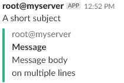

# Summary
Here you can find detailed instructions and examples to send [Slack](https://slack.com/) notifications a Linux shell using the `slack-shell-alert.sh` script.

# Synopsis
Usage: `slack-shell-alert.sh [OPTIONS]`, where `[OPTIONS]` are as follows:
* `-U <SLACK WEBHOOK URL>`: the URL of the Slack webkhook. See [README.md](https://github.com/flelli/slack-integrations#set-up-the-slack-webhook) on how to get one
* `-t <SLACK TEAM>`: the Slack team name. If you're in doubt, this is the first part of the Slack URL you use (i.e. if your Slack is at `myrockingteam.slack.com` then the team name to use here is `myrockingteam`)
* `-c <SLACK CHANNEL>`: the Slack channel or target user name. For channels don't forget to add the leading '#' while for individual users add the leading '#'. For example "#monitoring" will send the message to the "#monitoring" channel, while "@johndoe" will send it to the "jondoe" user. This may be ignored if the Slack webhook is configured for a fixed channel. This parameter gives you flexibility in deciding to send messages to individuals or to a channel as a whole but keep in mind that it may lead to duplicate messages if you don't set the contacts properly (see below)
* `-u <SLACK USER>`: the user to display as the message sender on Slack (i.e. "root"). This may be ignored if the Slack webhook is configured for a fixed user. You can also declare it as "root@server" if you have multiple servers and wish to disambiguate which server the message was originated from
* `-v <MESSAGE VERBOSITY>`: allowed values are `DETAILED` (for long, multi section/attachments message), `COMPACT` (for a message with just the headline and main section/attachment), `ONELINE` (for a message with just the headline). Default value: `DETAILED`
* `-C <MESSAGE COLOR>`: you can pass an hex color code or one of the [standard Slack colors](https://api.slack.com/docs/message-attachments)
* `-M <MESSAGE SUBJECT>`: the subject of the output message. This is always shown and if the `<MESSAGE VERBOSITY>` is `ONELINE` it will be the only message output
* `-B <MESSAGE BODY>`: the body of the output message which will appear in the attachments (shown only when `<MESSAGE VERBOSITY>` is `DETAILED` or `COMPACT`)

Examples are provided below along with the resulting screenshots.

# Set up
Just save the script and assign it proper execution rights. Optionally you can hardcode some options at the topo of the script source in case you don't want to set them on the command line every time.

## Example screenshots
### A *DETAILED* message


You can simulate this message by invoking the `slack-shell-alert.sh` manually like:
```
./slack-shell-alert.sh -U "<WEBHOOK_URL>" -t "<SLACK_TEAM>" -c "<SLACK_CHANNEL>" -u "root@myserver" -C "good" -M "A short subject" -B "Message body\non multiple lines"
```

### A *ONELINE* message


You can simulate this message by invoking the `slack-shell-alert.sh` manually like:
```
./slack-shell-alert.sh -U "<WEBHOOK_URL>" -t "<SLACK_TEAM>" -c "<SLACK_CHANNEL>" -u "root@myserver" -v "ONELINE" -M "A short subject" -B "Message body\non multiple lines"
```

