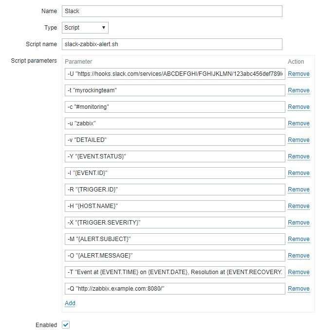
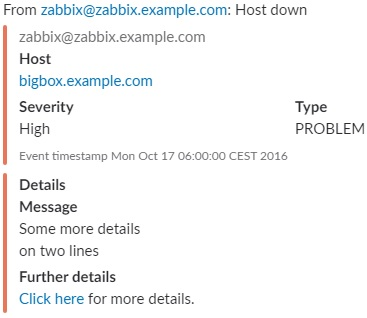
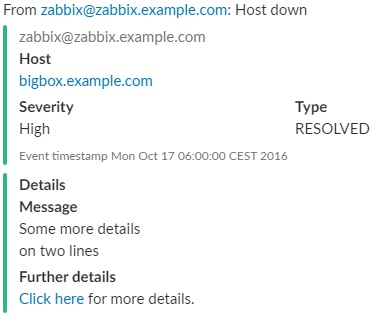
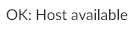
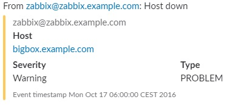
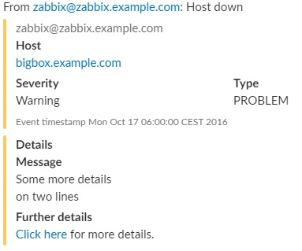

# Summary
Here you can find detailed instructions and examples to send [Slack](https://slack.com/) notifications from [Zabbix](https://www.zabbix.com/) using the `slack-zabbix-alert.sh` shell script.

# Synopsis
Usage: `slack-zabbix-alert.sh [OPTIONS]`, where `[OPTIONS]` are as follows:
* `-U <SLACK WEBHOOK URL>`: the URL of the Slack webkhook. See [README.md](https://github.com/flelli/slack-integrations#set-up-the-slack-webhook) on how to get one
* `-t <SLACK TEAM>`: the Slack team name. If you're in doubt, this is the first part of the Slack URL you use (i.e. if your Slack is at `myrockingteam.slack.com` then the team name to use here is `myrockingteam`)
* `-c <SLACK CHANNEL>`: the Slack channel or target user name. For channels don't forget to add the leading '#' while for individual users add the leading '#'. For example "#monitoring" will send the message to the "#monitoring" channel, while "@johndoe" will send it to the "jondoe" user. This may be ignored if the Slack webhook is configured for a fixed channel. This parameter gives you flexibility in deciding to send messages to individuals or to a channel as a whole but keep in mind that it may lead to duplicate messages if you don't set the contacts properly (see below). You should pass the value of Zabbix `{ALERT.SENDTO}` here
* `-u <SLACK USER>`: the user to display as the message sender on Slack (i.e. "zabbix"). This may be ignored if the Slack webhook is configured for a fixed user. You can also declare it as "zabbix@server" if you have myltiple servers and wish to disambiguate which server the message was originated from
* `-v <MESSAGE VERBOSITY>`: allowed values are `DETAILED` (for long, multi section/attachments message), `COMPACT` (for a message with just the headline and main section/attachment), `ONELINE` (for a message with just the headline). Default value: `DETAILED`
* `-Y <ZABBIX EVENT TYPE>`: the notification type (i.e. `PROBLEM` or `RESOLVED`) coming from Zabbix. You should pass the value of Zabbix `{EVENT.STATUS}` here
* `-I <ZABBIX EVENT ID>`: the event ID coming from Zabbix, used to build back links. You should pass the value of Zabbix `{EVENT.ID}` here
* `-R <ZABBIX TRIGGER ID>`: the trigger ID coming from Zabbix, used to build back links. You should pass the value of Zabbix `{TRIGGER.ID}` here
* `-H <ZABBIX HOST NAME>`: the host name coming from Zabbix (i.e. `someserver.example.com`). This is the host the notification is about, not the Zabbix server. You should pass the value of Zabbix `{HOST.NAME}` here
* `-X <ZABBIX SEVERITY>`: the Zabbix issue severity and can be `Not classified`, `Information`, `Warning`, `Average`, `High`, `Disaster`. This will also determine the colors used in the Slack message. You should pass the value of Zabbix `{TRIGGER.SEVERITY}` here
* `-M <ZABBIX OUTPUT SUBJECT>`: the service or host output message subject coming Zabbix. You should pass the value of Zabbix `{ALERT.SUBJECT}` here but you can also enrich it with other informations that will appear in the message details. If you use `{ALERT.SUBJECT}` then you will compose the subject on the Zabbix admin console under the Media Types page
* `-O <ZABBIX OUTPUT BODY>`: the service or host output message body coming Zabbix. You can add as many informations as you want here and they will be shown in the attachments. You should pass the value of Zabbix `{ALERT.MESSAGE}` here but you can also enrich it with other informations that will appear in the message details. If you use `{ALERT.MESSAGE}` then you will compose the subject on the Zabbix admin console under the Media Types page
* `-T <ZABBIX TIMESTAMP>`: the message event timestamp coming from Zabbix. here you should compose different fields from Zabbix, like `Event at {EVENT.TIME} on {EVENT.DATE}, Resolution at {EVENT.RECOVERY.TIME} on {EVENT.RECOVERY.DATE}` here
* `-Q <ZABBIX SERVER BASE URL>`: the base URL of the Zabbix server, **including the trailing slash**. Example: `http://zabbix.example.com:8080/`. This is used to build URLs in the notification message that can be clicked to access the Zabbix page for the problem. You can set the host part as a DNS name or IP address. It may be a private IP or name, in this case just remember that the back link will work only when connected to the private network that resolves the host name or IP

Examples are provided below along with the resulting screenshots.

# Set up

## Copy the script in the Zabbix folder
You first have to copy the `/slack-zabbix-alert.sh` script in the Zabbix plugins directory, usually `/usr/lib/zabbix/alertscripts/`. Also make sure that the Zabbix user has execution rights on the script.

Before you go any further you should test the script by sending manual notifications and simulate alerts from a shell. Example command lines are povided below along with the example screenshots.

## Set up the new Media Type in Zabbix
On the Zabbix console (make sure you have administrative rights), open **Administration -> Media types** and click on **Create media type** on the top right. Fill in the parameters like in the following screenshot, changing them to your needs.



**WARNING: Because of a Zabbix limitation that only accepts parameters up to 255 characters you may receive an error at this point**. While waiting for this limitation to be overcome by Zabbix, you can skip some parameters and hardcode them in the `slack-zabbix-alert.sh` script. In this case, just moving the Webhook url in there should be enough.


## Example screenshots
### A *High* priority problem message from Zabbix


You can simulate this message by invoking the `slack-zabbix-alert.sh` manually like:
```
./slack-zabbix-alert.sh -U "<WEBHOOK_URL>" -t "<SLACK_TEAM>" -c "<SLACK_CHANNEL>" -u "zabbix@zabbix.example.com" -v "DETAILED" -Y "PROBLEM"  -I 123 -R 456 -H "bigbox.example.com" -X "Warning" -A "192.168.1.1" -M "Host down" -O "Some more details\non two lines" -T "Mon Oct 17 06:00:00 CEST 2016" -Q "http://zabbix.example.com/"
```

### A *Resolved* message from Zabbix


You can simulate this message by invoking the `slack-zabbix-alert.sh` manually like:
```
./slack-zabbix-alert.sh -U "<WEBHOOK_URL>" -t "<SLACK_TEAM>" -c "<SLACK_CHANNEL>" -u "zabbix@zabbix.example.com" -v "DETAILED" -Y "RESOLVED" -I 123 -R 456 -H "bigbox.example.com" -X "Warning" -A "192.168.1.1" -M "Host down" -O "Some more details\non two lines" -T "Mon Oct 17 06:00:00 CEST 2016" -Q "http://zabbix.example.com/"
```

### Using verbosity
Here is how the same message appears with different verbosities set in the `-v <MESSAGE VERBOSITY>`:

With `-v "ONELINE"`:



With `-v "COMPACT"`:



With `-v "DETAILED"`:


