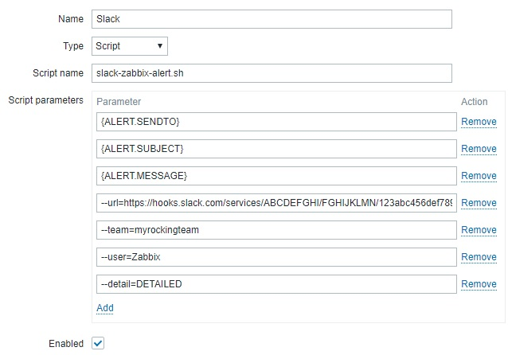
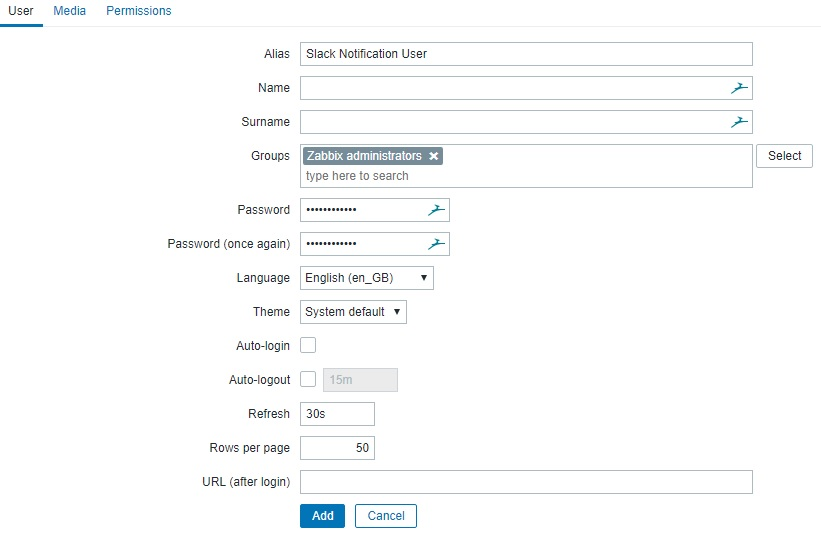

# Summary
Here you can find detailed instructions and examples to send [Slack](https://slack.com/) notifications from [Zabbix](https://www.zabbix.com/) using the `slack-zabbix-alert.sh` shell script.

# Synopsis
**Warning** Zabbix requires positional parameters, at least for the three first ones (`CHANNEL`, `SUBJECT`, `BODY`) so for them remember to declare them in the right order.

Usage: `slack-zabbix-alert.sh CHANNEL SUBJECT BODY [OPTIONS]`, where `[OPTIONS]` are as follows:
* `<CHANNEL>`: the Slack channel or target user name. For channels don't forget to add the leading '#' while for individual users add the leading '#'. For example "#monitoring" will send the message to the "#monitoring" channel, while "@johndoe" will send it to the "jondoe" user. This may be ignored if the Slack webhook is configured for a fixed channel. This parameter gives you flexibility in deciding to send messages to individuals or to a channel as a whole but keep in mind that it may lead to duplicate messages if you don't set the contacts properly (see below). You should pass the value of Zabbix `{ALERT.SENDTO}` here
* `<SUBJECT>`: the service or host output message subject coming Zabbix. You should pass the value of Zabbix `{ALERT.SUBJECT}` here but you can also enrich it with other informations that will appear in the message details. If you use `{ALERT.SUBJECT}` then you will compose the subject on the Zabbix admin console under the Media Types page
* `<BODY>`: the service or host output message body coming Zabbix. You can add as many informations as you want here and they will be shown in the attachments. You should pass the value of Zabbix `{ALERT.MESSAGE}` here but you can also enrich it with other informations that will appear in the message details. If you use `{ALERT.MESSAGE}` then you will compose the subject on the Zabbix admin console under the Media Types page
* `--url <SLACK WEBHOOK URL>`: the URL of the Slack webkhook. See [README.md](https://github.com/flelli/slack-integrations#set-up-the-slack-webhook) on how to get one
* `--team <SLACK TEAM>`: the Slack team name. If you're in doubt, this is the first part of the Slack URL you use (i.e. if your Slack is at `myrockingteam.slack.com` then the team name to use here is `myrockingteam`)
* `--user <SLACK USER>`: the user to display as the message sender on Slack (i.e. "zabbix"). This may be ignored if the Slack webhook is configured for a fixed user. You can also declare it as "zabbix@server" if you have myltiple servers and wish to disambiguate which server the message was originated from. Default value: `zabbix`
* `--detail <MESSAGE VERBOSITY>`: allowed values are `DETAILED` (for long, multi section/attachments message), `COMPACT` (for a message with just the headline and main section/attachment), `ONELINE` (for a message with just the headline). Default value: `DETAILED`
* `-d`: this flag enables debugging output so that, if you encounter issues in sending the message, you will find some more useful output on the Zabbix console

Examples are provided below along with the resulting screenshots.

# Set up

## Copy the script in the Zabbix folder
You first have to copy the `/slack-zabbix-alert.sh` script in the Zabbix plugins directory, usually `/usr/lib/zabbix/alertscripts/`. Also make sure that the Zabbix user has execution rights on the script.

Before you go any further you should test the script by sending manual notifications and simulate alerts from a shell. Example command lines are povided below along with the example screenshots.


## Set up the new Media Type in Zabbix
On the Zabbix console (make sure you have administrative rights), open **Administration -> Media types** and click on **Create media type** on the top right. Fill in the parameters like in the following screenshot, changing them to your needs.



As the `-c` parameter you probably want to set `{ALERT.SENDTO}` but that depends on the configuration you make on the next steps.

**WARNING: Because of a Zabbix limitation that only accepts parameters up to 255 characters you may receive an error at this point**. While waiting for this limitation to be overcome by Zabbix, you can skip some parameters and hardcode them in the `slack-zabbix-alert.sh` script. In this case, just moving the Webhook url in there should be enough.
Also consider that the `<SLACK USER>` and `<MESSAGE VERBOSITY>` have default values in the script so you may omit them if you don't need other values. The `<ZABBIX TIMESTAMP>` can be omitted, in which case it won't be added to the message but you may live without (and rely on Slack's timestamp).


## Set up the Slack Notification user in Zabbix
On the Zabbix console (make sure you have administrative rights), open **Administration -> Users** and click on **Create user** on the top right. Fill in the parameters like in the following screenshot, changing them to your needs and adjust the group membership to your organization but make sure it has the rights to see events and alerts.



Now click on **Media** and set the media parameters like in the following screenshot. In the **Sent to** parameter you have to set the Slack channel name (with the leading `#`) that you want to send messages to. In case you were setting the media for individual users instead of a channel, on the users' settings you should've set something like `@username`, where `username` is the one on Slack, not on Zabbix.


## Set up the Slack Notification action in Zabbix
On the Zabbix console (make sure you have administrative rights), open **Configuration -> Actions** and click on **Create action** on the top right. Fill in the parameters like in the following screenshots, changing them to your needs.


## Test the messages
Now you should be able to receive messages on Slack upon alerts.

## Example screenshots
### A *High* priority problem message from Zabbix


You can simulate this message by invoking the `slack-zabbix-alert.sh` manually like:
```
./slack-zabbix-alert.sh -U "<WEBHOOK_URL>" -t "<SLACK_TEAM>" -c "<SLACK_CHANNEL>" -u "zabbix@zabbix.example.com" -v "DETAILED" -Y "PROBLEM"  -I 123 -R 456 -H "bigbox.example.com" -X "Warning" -A "192.168.1.1" -M "Host down" -O "Some more details\non two lines" -T "Mon Oct 17 06:00:00 CEST 2016" -Q "http://zabbix.example.com/"
```

### A *Resolved* message from Zabbix


You can simulate this message by invoking the `slack-zabbix-alert.sh` manually like:
```
./slack-zabbix-alert.sh -U "<WEBHOOK_URL>" -t "<SLACK_TEAM>" -c "<SLACK_CHANNEL>" -u "zabbix@zabbix.example.com" -v "DETAILED" -Y "RESOLVED" -I 123 -R 456 -H "bigbox.example.com" -X "Warning" -A "192.168.1.1" -M "Host down" -O "Some more details\non two lines" -T "Mon Oct 17 06:00:00 CEST 2016" -Q "http://zabbix.example.com/"
```

### Using verbosity
Here is how the same message appears with different verbosities set in the `-v <MESSAGE VERBOSITY>`:

With `-v "ONELINE"`:


With `-v "COMPACT"`:


With `-v "DETAILED"`:


# Troubleshooting
## Running Zabbix server in a Docker container
If you're running Zabbix from [one of the official containers available on Docker Hub](https://hub.docker.com/u/zabbix/) you may encounter a couple of issues:
* if the `/usr/lib/zabbix/alertscripts/` is mounted as an host volume you may keep receiving the error *Permission denied* from Zabbix every time it tries to run the script. Just try not to mount the host volume and copy the script within the container image at the `/usr/lib/zabbix/alertscripts/` location
* `curl` may raise errors about passed options if you're using the *alpine* version of the container. In that case you have to create your own container and set up `curl` properly (this is the suggested option so the process is repeatable among container updates) or just open a shell in the running container (`docker exec -it zabbix-server /bin/bash`) and install additional packages (beware that in this case, when you update the container image, you lose the change and need to repeat). The packages you need to install are `libcurl` and `curl-dev`. From the command line just enter: `apk add --no-cache curl-dev libcurl`
