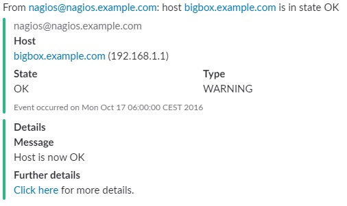
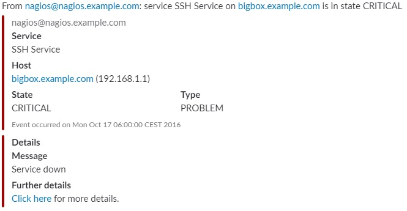

# Summary
Here you can find detailed instructions and examples to send [Slack](https://slack.com/) notifications from [Zabbix](https://www.zabbix.com/) using the `slack-zabbix-alert.sh` shell script.


# Synopsis
Usage: `slack-nagios-alert.sh [OPTIONS]`, where `[OPTIONS]` are as follows:
* `-U <SLACK WEBHOOK URL>`: the URL of the Slack webkhook. See below on how to get one
* `-t <SLACK TEAM>`: the slack team name. This is the first part of the Slack URL you use (i.e. if your Slack is at `myrockingteam.slack.com` then the team name to use here is `myrockingteam`)
* `-c <SLACK CHANNEL>`: the Slack channel name (without the leading '#', e.e. \"monitoring\" for using the \"#monitoring\" channel). This may be ignored if the Slack webhook is configured for a fixed channel.
* `-u <SLACK USER>`: the user to display as the message sender on Slack (i.e. \"nagios\"). This may be ignored if the Slack webhook is configured for a fixed user.
* `-W <NAGIOS TYPE>`: set it to `HOST` if it's an host notification or `SERVICE` if it's a service notification
* `-Y <NAGIOS NOTIFICATION TYPE>`: the notification type (i.e. `PROBLEM`) coming from Nagios
* `-H <NAGIOS HOST NAME>`: the host name coming from Nagios (i.e. `nagios.example.com`)
* `-A <NAGIOS HOST IP ADDRESS>`: this is the host IP address coming from Nagios
* `-S <NAGIOS SERVICE NAME>`: the service name the notification is about
* `-X <NAGIOS STATE>`: the Nagios issue severity and can be `CRITICAL`, `WARNING`, `OK`. This will also determine the colors used in the Slack message
* `-M <NAGIOS OUTPUT>`: the service or host output message coming Nagios (i.e. an error message)
* `-T <NAGIOS TIMESTAMP>`: the message timestamp coming from Nagios
* `-Q <NAGIOS SERVER BASE URL>`: the base URL of the Nagios server. This is used to build URLs in the notification message that can be clicked to access the Nagios page for the problem. This DNS name may be a private name, in this case just remember that the back link will work only when connected to the private network that resolves that DNS name

Examples are provided below along with the resulting screenshots.

# Set up
## Set up Slack alert notifications for Nagios
Before you go any further you can test the script by sending manual notifications and simulate alerts. Example command lines are povided below along with the example screenshots.

## Nagios settings

### Copy the script in the Nagios folder
You first have to copy the `/slack-nagios-alert.sh` script in the Nagios plugins directory, usually `/usr/local/nagios/libexec/`. Also make sure that the Nagios user has execution rights on the script.

### Define the notification commands in Nagios configuration
In the commands configuration file (usually `objects/commands.cfg`) add the Slack notification command. We need two commands, one for service notifications and one for hosts. Full descriptions is available in the [official Nagios docs](https://assets.nagios.com/downloads/nagioscore/docs/nagioscore/4/en/objectdefinitions.html#command). What follows is an example:
```
# The commands used for Slack channel notifications. They use custom address fields (addressX) to define Slack specific parameters
define command {
   command_name     service-notify-by-slack
   command_line     /usr/local/nagios/libexec/slack-nagios-alert.sh -U '$CONTACTADDRESS3$' -Q 'http://nagios.example.com/nagios' -t '$CONTACTADDRESS1$' -c '$CONTACTADDRESS2$' -u nagios -W SERVICE -Y '$NOTIFICATIONTYPE$' -S '$SERVICEDESC$' -H '$HOSTNAME$' -A '$HOSTADDRESS$' -X '$SERVICESTATE$' -M '$SERVICEOUTPUT$' -T '$LONGDATETIME$'
}

define command {
      command_name     host-notify-by-slack
      command_line     /usr/local/nagios/libexec/slack-nagios-alert.sh -U '$CONTACTADDRESS3$' -Q 'http://nagios.example.com/nagios' -t '$CONTACTADDRESS1$' -c '$CONTACTADDRESS2$' -u nagios -W HOST -Y '$NOTIFICATIONTYPE$' -H '$HOSTNAME$' -A '$HOSTADDRESS$' -X '$SERVICESTATE$' -M '$SERVICEOUTPUT$' -T '$LONGDATETIME$'
}
```

### Define the contact in Nagios configuration
In the contacts configuration file (usually `objects/contacts.cfg`) add the Slack notification contact. Full descriptions is available in the [official Nagios docs](https://assets.nagios.com/downloads/nagioscore/docs/nagioscore/4/en/objectdefinitions.html#contact). What follows is an example:
```
define contact{
   contact_name                    slack
   alias                           Slack
   
   service_notification_commands   service-notify-by-slack
   host_notification_commands      host-notify-by-slack

   address1                        SLACK_TEAM              ; set the name of the Slack team
   address2                        SLACK_CHANNEL           ; set the name of the Slack channel to post to
   # Use the Slack Webhook URL here
   address3                        https://hooks.slack.com/services/ABCDEFGHI/FGHIJKLMN/123abc456def789ldt645Bgs
        }
```

### Test the configuration
Now it's all set and you should be able to receive notifications to your Slack channel. Just trigger some test alerts to make sure.

### Example screenshots
#### A *CRITICAL* message about a *HOST* from Nagios


You can simulate this message by invoking the `slack-nagios-alert.sh` manually like:
```
./slack-nagios-alert.sh -U "<WEBHOOK_URL>" -t <SLACK_TEAM> -c <SLACK_CHANNEL> -u <SLACK_USER> -W HOST -Y PROBLEM -H bigbox.example.com -A 192.168.1.1 -X CRITICAL -M "Host down" -T "Mon Oct 17 06:00:00 CEST 2016" -Q "http://nagios.example.com/nagios"
```

#### A *WARNING* message about a *HOST* from Nagios


You can simulate this message by invoking the `slack-nagios-alert.sh` manually like:
```
./slack-nagios-alert.sh -U "<WEBHOOK_URL>" -t <SLACK_TEAM> -c <SLACK_CHANNEL> -u <SLACK_USER> -W HOST -Y WARNING -H bigbox.example.com -A 192.168.1.1 -X CRITICAL -M "Host unreachable" -T "Mon Oct 17 06:00:00 CEST 2016" -Q "http://nagios.example.com/nagios"
```

#### An *OK* message about a *HOST* from Nagios


You can simulate this message by invoking the `slack-nagios-alert.sh` manually like:
```
./slack-nagios-alert.sh -U "<WEBHOOK_URL>" -t <SLACK_TEAM> -c <SLACK_CHANNEL> -u <SLACK_USER> -W HOST -Y WARNING -H bigbox.example.com -A 192.168.1.1 -X OK -M "Host is now OK" -T "Mon Oct 17 06:00:00 CEST 2016" -Q "http://nagios.example.com/nagios"
```

#### A *CRITICAL* message about a *SERVICE* from Nagios


You can simulate this message by invoking the `slack-nagios-alert.sh` manually like:
```
./slack-nagios-alert.sh -U "<WEBHOOK_URL>" -t <SLACK_TEAM> -c <SLACK_CHANNEL> -u <SLACK_USER> -W SERVICE -Y PROBLEM -H bigbox.example.com -A 192.168.1.1 -S SSH -X CRITICAL -M "Service down" -T "Mon Oct 17 06:00:00 CEST 2016" -Q "http://nagios.example.com/nagios"
```

#### A *WARNING* message about a *SERVICE* from Nagios


You can simulate this message by invoking the `slack-nagios-alert.sh` manually like:
```
./slack-nagios-alert.sh -U "<WEBHOOK_URL>" -t <SLACK_TEAM> -c <SLACK_CHANNEL> -u <SLACK_USER> -W SERVICE -Y PROBLEM -H bigbox.example.com -A 192.168.1.1 -S SSH -X WARNING -M "Service unreachable" -T "Mon Oct 17 06:00:00 CEST 2016" -Q "http://nagios.example.com/nagios"
```

#### An *OK* message about a *SERVICE* from Nagios


You can simulate this message by invoking the `slack-nagios-alert.sh` manually like:
```
./slack-nagios-alert.sh -U "<WEBHOOK_URL>" -t <SLACK_TEAM> -c <SLACK_CHANNEL> -u <SLACK_USER> -W SERVICE -Y PROBLEM -H bigbox.example.com -A 192.168.1.1 -S SSH -X OK -M "Service is now OK" -T "Mon Oct 17 06:00:00 CEST 2016" -Q "http://nagios.example.com/nagios"
```
